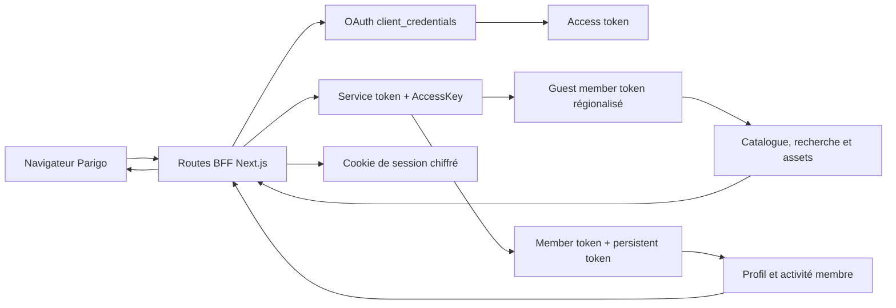

# Audit de l’intégration Harvest et des permissions d’écriture

- Date de l’audit : 28 juillet 2026
- Périmètre : application Parigo, BFF Next.js et Harvest Media Public API
- État de la campagne : audit, corrections Parigo attribuées, rerun membre live, comparaison documentaire et contrôle de persistance terminés
- Compte utilisé : compte membre Anthlogan ; aucune donnée personnelle ni aucun token n’est reproduit dans ce rapport
- Nettoyage : toutes les ressources temporaires effectivement créées ont été supprimées et relues ; le compte, son mot de passe et son image n’ont pas été supprimés ou remplacés

## Synthèse exécutive

L’intégration publique Harvest est opérationnelle. La chaîne OAuth `client_credentials` → service token avec `AccessKey` → région → guest member token → recherche a été rejouée en direct avec des réponses HTTP 200. Les principales routes publiques du BFF ont également répondu en HTTP 200 avec des données live : albums, tracks, labels, playlists éditoriales, recherche, autocomplete, catégories, pays, formats de téléchargement et waveforms.

La campagne membre change le diagnostic initial : les credentials actuels ne sont pas globalement « lecture seule ». Sont fonctionnels et persistants avec le compte Anthlogan : login, renouvellement par persistent token, favoris track, recherches sauvegardées, tags et associations tag-track, mise à jour réversible du profil, lecture des historiques, copie/suppression d’une playlist éditoriale et modification d’une playlist lorsque les champs documentés sont utilisés. Les ressources de test ont été relues directement chez Harvest, puis supprimées.

Les lacunes sont sélectives. `suggestmemberplaylisttracks` renvoie HTTP 200 avec `Error.Code=3` et le message explicite indiquant que la fonctionnalité n’est pas activée sur le compte. Les défauts attribués à Parigo ont été corrigés et retestés : `copytomemberplaylist` copie désormais les 11 tracks avec `CopyTracks:true`, `updateplaylist` persiste avec `PlaylistName`/`PlaylistDescription`, le retrait d’une track est relu avant succès, les erreurs `Error`/`error` sont qualifiées et les faux succès ont été supprimés. À l’inverse, `addmemberplaylist` ne crée toujours aucune ressource avec `PlaylistName`/`PlaylistDescription`, et `addtomemberplaylists` échoue encore avec le contrat officiel `ObjectType`/`ObjectIDs`/`AddToPlaylistIDs`.

La shortlist anonyme fonctionne et ne dépend pas de Harvest : trois tracks sont conservées dans `localStorage` avec leur ordre et `addedAt`, y compris après reload et après connexion. La conversion échoue ensuite précisément à la première étape distante : après le correctif, le BFF répond 502 `INVALID_UPSTREAM_RESPONSE` parce qu’aucun ID Harvest n’est créé. Le POST d’ajout des trois tracks n’est donc jamais atteint et la shortlist reste intacte avec un message d’échec. Le faux 201 avec `playlist:null` a été supprimé.

Le problème de date « Birthday » a été tracé puis corrigé côté Parigo. Harvest renvoie `CreatedDate=2026-07-29T00:24:11.477` sans offset et le member token indique `UTCOffset=10`. Parigo conserve désormais cet offset dans la session chiffrée, normalise l’instant en `2026-07-28T14:24:11.477Z` et formate explicitement en `Europe/Paris` : l’interface affiche donc `28/07/2026`, quel que soit le fuseau du runtime ou du navigateur. Harvest doit encore confirmer la sémantique contractuelle des timestamps sans offset, mais cette confirmation ne bloque plus un affichage déterministe.

La documentation disponible décrit les endpoints, les types de tokens et les codes fonctionnels, mais ne publie pas de noms de scopes OAuth ou de matrice de permissions. Il faut donc demander à Harvest les noms exacts de ses capacités, rôles ou options de compte et ne pas inventer des scopes tels que `favorites:write`.

Le BFF doit être conservé. Il protège le `client_secret`, l’`AccessKey`, les access/service/member tokens et le persistent token ; il porte aussi la session chiffrée, la régionalisation, les caches, les validations, les transformations de données et la gestion des erreurs. Une simplification interne est possible, mais une suppression nécessiterait un flux navigateur sûr non documenté par Harvest.

### Conclusion par domaine

| Domaine | Conclusion | Niveau de preuve |
|---|---|---|
| Authentification serveur | OAuth, `AccessKey` et service token fonctionnels | Fait observé en live |
| Catalogue public | Les lectures principales fonctionnent via le BFF | Fait observé en live |
| Recherche publique | `cloudsearch`, filtres et autocomplete fonctionnent | Fait observé en live |
| Authentification membre | Login, session publique, persistent login et logout fonctionnels | Fait observé en live |
| Écritures membre fonctionnelles | Favoris track, recherches sauvegardées, tags/relations, profil, copie/suppression de playlist et update playlist avec contrat officiel | Fait observé en live |
| Corrections BFF livrées | Contrats playlist documentés, `CopyTracks:true`, détection `Error`/`error`, statuts, relecture des mutations, mapper History, UTCOffset, `Europe/Paris` et templates d’assets encodés | Fait de code + observation live après correction |
| Écritures encore en échec après contrat officiel | Création de playlist, ajout/reorder de tracks, validation download ; bodies comments/cue sheet non publiés | Fait observé + information manquante |
| Permission explicitement refusée | Suggestions de playlist : `Error.Code=3`, fonctionnalité non activée | Fait observé en live |
| Scopes Harvest | Aucun nom de scope n’est publié dans les sources disponibles | Fait documenté |
| BFF | Nécessaire avec le modèle d’authentification actuel | Déduction étayée par le code et la documentation |
| Import/édition catalogue | Hors du besoin membre ; relève de l’Import API et d’autres credentials | Fait documenté |

## Sources et méthode

### Sources de vérité

- `README.md` pour l’architecture et les commandes ;
- `src/lib/harvest/client.ts` pour OAuth, les tokens, les retries et les appels HTTP ;
- `src/lib/harvest/session.ts` pour la session membre ;
- `src/lib/harvest/catalog.ts`, `member.ts` et `activity.ts` pour les contrats Harvest ;
- `src/app/api/` pour les routes BFF ;
- `src/components/`, `src/app/account/` et `src/stores/` pour les parcours visibles ;
- `docs/harvest/rapport-harvest-api.md` et `endpoint-inventory.csv` pour la documentation extraite de la collection Harvest ;
- [documentation officielle Harvest Media Public API](https://developer.harvestmedia.net/) et collection publiée `SVYouLCf`, version `latest`, relue le 28 juillet 2026 ;
- smoke tests et tests E2E du dépôt.

### Qualification des preuves

| Libellé | Signification |
|---|---|
| Fait documenté | Présent dans la documentation Harvest extraite ou dans un contrat explicite |
| Fait de code | Présent dans l’implémentation Parigo, sans garantie de succès live |
| Fait observé en live | Reproduit contre Harvest ou le BFF local le 28 juillet 2026 |
| Déduction | Conclusion technique justifiée, mais non affirmée par Harvest |
| Information manquante | Élément que le code et la documentation ne permettent pas de trancher |

## Architecture actuelle



### Responsabilités réelles

| Responsabilité | Implémentation | Observation |
|---|---|---|
| Access token | `client.ts` envoie `grant_type`, `client_id`, `client_secret` | Cache mémoire avec marge d’expiration |
| Service token | `getservicetoken` avec `Authorization` et `AccessKey` | Fonctionnel live |
| Région | région par défaut, service info, puis repli `getregions` | Fonctionnel live avec région Global |
| Guest token | `getguestmembertoken` par région | Fonctionnel live |
| Member token | `getmembertoken` avec persistent login | Compte Anthlogan actif ; `UTCOffset` conservé dans la session |
| Session | JWE `A256GCM` dans un cookie `httpOnly`, `SameSite=Lax` | Le persistent token reste côté serveur/cookie chiffré |
| Catalogue | appels guest puis mappers Parigo | Cache public court |
| Données membre | appels avec member token | `Cache-Control: no-store` sur les réponses normales |
| Validation | schémas Zod au niveau des routes | Les entrées invalides testées renvoient 400 |
| CSRF/origine | `assertSameOrigin` sur la majorité des mutations | 403 observé avec une origine étrangère |
| Erreurs | `HarvestError` puis réponse BFF normalisée | Codes 1-22 qualifiés ; code 3 en 403, code amont conservé côté serveur |
| Assets | templates fournis par `getserviceinfo` | Placeholders littéraux ou `%7B…%7D` remplacés ; URLs directes pour Range et tracking |

## Résultats live publics

### Chaîne Harvest directe

Le smoke test `HARVEST_LIVE_TESTS=1 pnpm test:harvest` a obtenu :

| Étape | Résultat |
|---|---|
| OAuth | HTTP 200, access token présent |
| Service token | HTTP 200 |
| Service info | HTTP 200, templates stream/artwork/waveform présents |
| Régions | HTTP 200, région Global disponible |
| Guest member token | HTTP 200 |
| `cloudsearch` | HTTP 200, 29 102 tracks et 3 808 albums annoncés pour la recherche de contrôle |

Les tokens et les paramètres d’URL sensibles ont été expurgés de la sortie.

### Routes BFF publiques

| Route | Résultat live | Observation |
|---|---|---|
| `GET /api/health` | 200 | catalogue, compte et distant configurés/disponibles |
| `GET /api/albums?limit=3` | 200 | 3 albums, total BFF 7 843 |
| `GET /api/albums/{id}` | 200 | album détaillé et 6 similaires |
| `GET /api/tracks?albumId={id}` | 200 | 12 tracks pour l’album de contrôle |
| `GET /api/tracks/{id}` | 200 | track détaillée |
| `GET /api/tracks/{id}/waveform` | 200 | JSON et cache asset long |
| `GET /api/labels` | 200 | 99 labels |
| `GET /api/labels/{id}` | 200 | détail du label de contrôle |
| `GET /api/playlists?limit=3` | 200 | 3 playlists, total BFF 4 |
| `GET /api/playlists/{id}` | 200 | détail de playlist |
| `GET /api/search?q=piano&view=tracks&limit=3` | 200 | 3 résultats, total annoncé 29 102 |
| `GET /api/search/filters?language=fr` | 200 | 7 groupes |
| `GET /api/autocomplete?q=piano&language=fr` | 200 | 6 groupes |
| `GET /api/categories?language=fr` | 200 | 6 groupes |
| `GET /api/genres`, `/moods`, `/instruments` | 200 | réponses historiques hors enveloppe `data/meta` |
| `GET /api/countries` | 200 | 245 pays |
| `GET /api/download-formats` | 200 | 6 formats |

Les identifiants live utilisés pour les détails ont été obtenus par les routes de liste, jamais saisis ou supposés.

### Parcours navigateur

Les pages publiques suivantes ont été ouvertes avec Chromium contre le serveur local :

- accueil ;
- albums et détail d’album ;
- labels et détail de label ;
- playlists et détail de playlist ;
- recherche `piano`.

Résultats :

- toutes les navigations ont répondu en HTTP 200 ;
- les titres issus de Harvest étaient visibles ;
- aucune erreur console JavaScript n’a été observée ;
- les contrôles mobile à 390 px n’ont montré aucun débordement horizontal ;
- toutes les pages `/account/*` sans session ont redirigé vers `/login?next=%2Faccount`.

Les requêtes marquées `ERR_ABORTED` pendant la boucle desktop correspondent aux navigations successives qui interrompent les chargements précédents, pas à un échec stable de l’endpoint ; les mêmes endpoints ont répondu 200 lorsqu’ils ont été appelés directement.

## Résultats live membre avec le compte Anthlogan

### Synthèse des capacités réellement observées

| Fonctionnalité | Harvest direct | BFF | Persistance/relecture | Attribution |
|---|---|---|---|---|
| Login membre | HTTP 200, `MemberToken` et persistent token présents | HTTP 200, cookie de session, aucun token dans le JSON public | Session publique relue puis logout vérifié | Fonctionnel |
| Renouvellement persistent login | HTTP 200 et nouveau `MemberToken` | Flux implémenté par la session | Contrat Harvest confirmé | Fonctionnel |
| Favori track | Ajout et retrait acceptés | POST/DELETE 200 | Visible immédiatement, conservé après reload, puis absent après nettoyage | Fonctionnel |
| Recherche sauvegardée | `cloudsearch` renvoie un `SearchHistoryID`; add/remove acceptés | POST 201, DELETE 200 | Nom et `PARIGO_URL:` relus, ressource supprimée | Fonctionnel |
| Tags personnels | Create/update/add track/remove track/delete acceptés | 201/200 | Chaque état relu directement ; tag supprimé | Fonctionnel |
| Profil | `updatemember` accepte la valeur sentinelle | PUT 200 | Valeur modifiée puis valeur initiale restaurée | Fonctionnel |
| Abonnement | `membersubscribe` renvoie HTTP 200 et `Code` | PUT 200 | L’état intermédiaire ne change pas ; état initial final confirmé | Succès HTTP sans effet métier |
| Lecture historique | HTTP 200, 6 `HistoryItems` et 3 `Tracks` | GET 200, 6 événements, total 6 | Chaque événement est relié par `TrackID`, daté avec `DeliveryDate` et `UTCOffset=10` | Fonctionnel après correction du mapper |
| Historique de downloads | HTTP 200 | GET 200 | Lecture sans consommation | Fonctionnel en lecture |
| Création playlist vide | Payload officiel : HTTP 200 avec `{}` | 502 `INVALID_UPSTREAM_RESPONSE` après polling borné | Aucune ressource dans `getmemberplaylistsnotracks` avec `Limit=500` | Capacité/prérequis Harvest à confirmer ; faux succès Parigo corrigé |
| Copie featured playlist | `CopyTracks:true` : 11 tracks | 200 avec ID et playlist relue | Copie complète, modifiée, supprimée et absence confirmée | Fonctionnel après correction BFF |
| Update playlist | `PlaylistName`/`PlaylistDescription` persistent | 200 avec playlist relue | Valeurs officielles relues | Fonctionnel après correction BFF |
| Ajout track playlist | Contrat officiel : objet `error`, code 4 | 503 `ACCOUNT_UNAVAILABLE` | Track absente après polling 0/250 ms/1 s/3 s | Échec Harvest correctement détecté ; capacité/prérequis à confirmer |
| Retrait track playlist | Harvest peut renvoyer une erreur contradictoire | 200 uniquement après relecture | Track absente directement et via le BFF | Fonctionnel par preuve d’état ; body canonique encore à demander |
| Réordonnancement | Contrat officiel relatif exercé ; `Error.Code=4` | 503, jamais `verified:true` sans preuve | Ordre inchangé | Capacité/exemple live officiel nécessaire |
| Suggestions playlist | HTTP 200, `Error.Code=3`, fonctionnalité non activée | 403 `FORBIDDEN` | Aucun résultat | Permission/capacité Harvest explicitement absente et correctement qualifiée |
| Note privée | HTTP 200, `Error.Code=2`, « Cannot add a tag when trackid is empty » | 502 `ACCOUNT_UNAVAILABLE` | Aucune note créée | Contrat/payload invalide, pas une preuve de permission |
| Validation download | Champs officiels minuscules : HTTP 400, corps vide | BFF utilise désormais le contrat officiel | Aucun token confirmé ; `getmusicdownload` non relancé pendant le rerun | Format, droit ou prérequis à confirmer |
| Cue sheet | HTTP 200, `Error.Code=2`, « Incorrect Input Data » | 400 `VALIDATION_FAILED` | Aucune URL valide | Contrat/payload invalide ou prérequis non documenté |

### Nettoyage et garde-fous

- Trois campagnes automatisées et un parcours UI favoris ont utilisé des noms sentinelles `Parigo audit …`.
- Les favoris track créés ont été supprimés et leur absence a été relue.
- Les copies de playlists, recherches sauvegardées, tags et associations ont été supprimés puis recherchés à nouveau.
- La vérification finale des listes playlists, searches et tags renvoie zéro occurrence du préfixe `Parigo audit 20260728-`.
- Les tentatives de playlist vide et de note n’ont créé aucune ressource distante.
- Le champ `website` du profil a été modifié puis restauré à sa valeur exacte.
- L’abonnement a été demandé dans l’état opposé, mais Harvest n’a pas reflété le changement ; l’état initial a été confirmé en fin de test.
- Le compte n’a jamais été supprimé. Son image existante n’a pas été remplacée. Aucun favori album non nettoyable n’a été créé.
- Un téléchargement a pu être amorcé pendant un premier passage UI avant que la navigation asset ne soit interrompue ; aucun second essai n’a été lancé. Les diagnostics directs ultérieurs ont refusé les deux payloads de validation et aucun token/fichier/quota nouveau n’a été confirmé.
- La route de changement de mot de passe a été tentée une seule fois avec l’autorisation donnée et a répondu 502 ; aucun succès d’émission n’a été constaté.
- Un partage e-mail vers l’adresse du compte a été tenté une seule fois sur une copie d’audit et a répondu 502 ; aucune URL ni émission réussie n’a été constatée. La copie a été supprimée et relue.

### Parcours UI ciblés

Sur Chromium desktop 1440 × 900 et mobile 390 × 844 avec une vraie session Anthlogan :

- les huit espaces `/account`, favoris, playlists, recherches, historique, téléchargements, tags et réglages répondent HTTP 200 ;
- la track de contrôle expose lecture, information, notes, téléchargement, playlist, tag, cue sheet, queue, shortlist et partage ; l’interface mobile expose bien le favori, contrairement au premier harness qui ne sélectionnait pas le bon contrôle ;
- un favori track ajouté depuis Search est visible immédiatement chez Harvest, dans le BFF et dans Account après reload, sur desktop et mobile ; le retrait est également confirmé à 0 ms ;
- information, versions et paroles s’ouvrent sur la bonne track lorsque les données sont disponibles ;
- la note privée appelle bien la route de commentaires mais aboutit à 502 après le code fonctionnel Harvest 2 ;
- le cue sheet aboutit à 502 après le code fonctionnel Harvest 2 ;
- la recherche sauvegardée depuis Search obtient un ID, apparaît dans Account avec sa date, puis est supprimée ;
- la shortlist anonyme conserve trois IDs, l’ordre et `addedAt`, n’appelle aucune route membre, survit au reload et à la connexion, et lance correctement la lecture de la sélection ;
- la conversion shortlist échoue à `addmemberplaylist` avec 502 explicite, affiche « La playlist n’a pas pu être créée » et ne vide jamais la sélection ;
- le logout répond 200 et aucune suppression de compte n’a été appelée.

Le test UI d’historique ne peut pas, à lui seul, conclure sur la création d’un événement : la préécoute passe directement par l’URL asset Harvest. Après correction, la réponse directe et le BFF contiennent tous deux six événements ; chaque `playedAt` provient de `HistoryItems[].DeliveryDate` et de son `UTCOffset=10`.

## Authentification et sécurité des routes

### Contrôles réalisés

- Les routes membre en lecture renvoient 401 `UNAUTHENTICATED` sans cookie.
- Les mutations membre testées sans session mais avec une origine locale valide renvoient 401.
- Les mutations protégées testées avec `Origin: https://evil.example` renvoient 403 `FORBIDDEN`.
- Les payloads invalides des routes login, register, forgot-password, reset-password et verify renvoient 400 sans déclencher d’e-mail.
- `GET /api/auth/session` renvoie 200 avec une session nulle et `no-store`.

### Écarts de sécurité ou de contrat

| Preuve | Écart | Impact | Recommandation |
|---|---|---|---|
| Fait observé + fait de code | `POST /api/auth/verify` n’appelle pas `assertSameOrigin` | La mutation n’a pas la protection cohérente des autres routes auth | Ajouter le contrôle lors d’un chantier correctif |
| Fait observé + fait de code | `POST /api/user/history` renvoie 200 sans session et ne fait aucune écriture | Route ambiguë ; un client peut croire qu’une audition a été persistée | Retirer la mutation simulée ou exiger une session et expliciter le contrat |
| Fait observé + fait de code | `DELETE /api/user/history` renvoie 405 sans session ni request ID | Faible risque de sécurité, mais contrat incohérent avec les autres routes | Uniformiser auth, origine et enveloppe d’erreur |
| Fait de code | Le firewall versionné cible surtout contact et auth publique | Les mutations membre ne disposent pas du même rate limiting applicatif/edge explicite | Étendre après mesure des usages |
| Fait de code | L’upload d’image valide le type mais pas la taille côté BFF | Risque de fichier volumineux vers l’URL présignée | Demander la limite Harvest et appliquer une limite Parigo |

## Cartographie fonctionnelle et permissions

La matrice exhaustive se trouve dans `runtime-route-matrix.csv`. La synthèse suivante regroupe les capacités.

| Fonctionnalité | Token | Endpoints principaux | Nature | État |
|---|---|---|---|---|
| Catalogue et recherche | Guest/member | `cloudsearch`, `gettracks`, albums, libraries, playlists, categories | Lecture, même lorsque la méthode HTTP est POST | Fonctionnel live |
| Comptes | Service/member | login, persistent login, get/update member | Lecture et écriture | Login/refresh/profil live fonctionnels ; reset e-mail tenté une fois, BFF 502 |
| Favoris | Member | `getfavourites`, `addtofavourites`, `removefavouritestrack` | Lecture, création, suppression | Track CRUD live fonctionnel ; album non muté faute de cleanup officiel |
| Playlists membre | Member | get/add/update/remove playlist, tracks, reorder, suggestions, copy, share | CRUD | Update et copy fonctionnent avec le contrat officiel ; create/add/reorder restent bloqués ; suggestions refusées code 3 |
| Recherches sauvegardées | Member | search/add/remove member saved search | Lecture, création, suppression | Cycle live complet fonctionnel et nettoyé |
| Tags | Member | get/add/update/remove tags et relations track | CRUD | Cycle live complet fonctionnel et nettoyé |
| Notes privées | Member | get/add/update/remove track member comment | CRUD | Création refusée code 2 « trackid empty » avec le payload actuel |
| Historique | Member/asset | `gethistorybymembertoken`, URL de stream suivie | Lecture ; écriture indirecte | Harvest renvoie les événements ; mapper BFF incorrect ; no-op POST confirmé |
| Téléchargements | Member/service | validation, demande, info, historique | Lecture et opération consommable | Validation BFF/officielle refusée HTTP 400 ; aucun token/quota nouveau confirmé |
| Cue sheet | Member | `getcuesheet` | Génération | Tenté ; code 2 Harvest puis BFF 502 |
| Import catalogue | Session Import | endpoints `insert`, `update`, `delete`, publish | CRUD catalogue | Hors périmètre du site actuel |

### Permissions à demander

La demande doit porter sur des capacités Harvest réelles, à nommer par Harvest :

1. lecture des données membre ;
2. ajout et retrait de favoris track et album ;
3. création, modification et suppression de playlists membre ;
4. ajout, retrait et réordonnancement des tracks d’une playlist ;
5. copie d’une playlist éditoriale et suggestions ;
6. création et suppression de recherches sauvegardées ;
7. création, modification, suppression et assignation de tags ;
8. création, modification et suppression de commentaires/notes privées ;
9. modification du profil, de l’abonnement et de l’image ;
10. éventuellement partage, cue sheet et téléchargement, à qualifier séparément.

Les management tokens, l’administration des groupes et l’Import API ne sont pas requis pour ces activités membre.

## Limitations et contournements

| Preuve | Comportement | Couche actuelle | Conclusion |
|---|---|---|---|
| Fait de code | Les filtres de playlists éditoriales sont calculés sur la liste chargée | Navigateur | Déplacer au BFF si le volume ou la logique métier augmente ; un endpoint Harvest plus riche serait préférable |
| Fait observé live + code | Le favori est présent en mobile, mais le premier harness ne sélectionnait pas le contrôle visible | Harness | Verdict initial invalidé ; garder le locator qui ouvre/filtre les actions mobiles |
| Fait de code | Les albums favoris sont reconstruits en groupant les tracks favorites | BFF | Fragile si Harvest renvoie les albums dans une collection distincte |
| Fait de code | La suppression d’un album favori supprime chaque track favorite de l’album | BFF | Ne prouve pas la suppression de l’objet album favori |
| Fait de code | L’URL Parigo est stockée dans `Description` avec `PARIGO_URL:` | BFF | Contournement réversible, mais mélange donnée utilisateur et donnée technique |
| Fait de code/documenté | Les notes Harvest sont mappées depuis les champs tag/comment | BFF | Conserver l’adaptateur, vérifier les identifiants live |
| Fait de code/documenté | L’historique est alimenté par l’URL audio suivie | Harvest/asset | Ne pas dupliquer l’écriture dans Parigo |
| Fait documenté | Aucun endpoint de vidage de l’historique public n’est identifié | BFF | La route DELETE doit rester indisponible ou être retirée |
| Fait de code corrigé | Les mutations playlist sont relues à 0/250 ms/1 s/3 s | BFF | Succès renvoyé uniquement après état distant conforme |
| Fait de code corrigé | Retrait et réordonnancement exigent une relecture | BFF | Aucun `verified:true` sans preuve |
| Fait observé après correction | `copytomemberplaylist` envoie `CopyTracks:true` | BFF | Copie de 11 tracks, ID relu et nettoyage confirmé |
| Fait observé après correction | `updateplaylist` envoie `PlaylistName`/`PlaylistDescription` | BFF | Nom et description persistent |
| Fait observé après correction | History mappe `HistoryItems` vers `Tracks` | BFF | Six événements, `DeliveryDate`, `UTCOffset`, type et ordre conservés |
| Fait observé après correction | `asIsoDate` utilise l’offset membre ou `Europe/Paris` explicitement | BFF puis navigateur | `birthday` s’affiche au 28/07/2026 de façon déterministe |
| Fait de code | Les enrichissements compositeurs/vidéos restent locaux | Éditorial Parigo | Maintenir tant que Harvest ne confirme pas les entités et relations |
| Fait documenté/code | Les URLs audio restent directes | Navigateur/Harvest CDN | Nécessaire pour Range et tracking ; ne pas proxyfier sans accord Harvest |

## Endpoints problématiques ou insuffisants

| Statut de preuve | Endpoint Harvest | Comportement observé ou attendu | Limitation | Contournement actuel | Impact | Vérification demandée |
|---|---|---|---|---|---|---|
| Fait observé + code | `getfavourites` | Favoris track fonctionnels ; le mapper ne lit que `Tracks` | Forme et retrait des albums favoris non validés | Regroupement par `albumId` | Album favori potentiellement invisible ou non supprimé | Fournir forme et retrait exacts des favoris album |
| Information manquante | Suppression album favori | Aucun endpoint dédié identifié | Suppression de l’objet album non prouvable | Suppression de toutes les tracks favorites de l’album | Donnée distante possiblement persistante | Confirmer l’endpoint officiel |
| Fait de code | `addtofavourites` | Mutation documentée en GET | Retry HTTP traité comme idempotent | Aucun | Effets répétés ou diagnostic ambigu | Confirmer l’idempotence |
| Fait de code | `removeplaylist` et autres suppressions GET | Mutations documentées en GET | Retry automatique possible | Aucun | Effet potentiellement rejoué | Confirmer l’idempotence |
| Fait observé après correction | `addmemberplaylist` | Payload officiel `PlaylistName`/`PlaylistDescription` : HTTP 200 `{}`, aucune ressource | Le contrat publié ne suffit pas sur ce compte | BFF répond 502 après polling et conserve la shortlist | Création bloquante sans faux succès | Confirmer prérequis, capacité et réponse attendue |
| Fait observé après correction | `copytomemberplaylist` | `CopyTracks:true` : copie de 11 tracks | Corrigé côté Parigo | ID, contenu, update et suppression relus | Fonctionnel | Aucun support requis pour ce point |
| Fait observé après correction | `updateplaylist` | Champs officiels persistés | Corrigé côté Parigo | Playlist retournée après relecture | Fonctionnel | Aucun support requis pour ce point |
| Fait observé après correction | `addtomemberplaylists` | Contrat officiel ; HTTP 200, clé `error`, code 4, aucune relation | Erreur maintenant détectée ; contrat live encore insuffisant | Polling BFF 0/250 ms/1 s/3 s puis 503 | Shortlist et ajout unitaire bloqués | Fournir un exemple qui fonctionne sur ce compte |
| Fait observé live | `removeplaylisttracks` | HTTP 400 sans corps utile avec le payload actuel | Contrat exact non confirmé | BFF transforme le cas en indisponibilité | Suppression non prouvable | Fournir payload canonique et réponse d’erreur |
| Fait observé après correction | `reordermemberplaylisttracks` | Contrat relatif officiel exercé : `Error.Code=4`, ordre inchangé | Exemple officiel live non concluant | BFF répond 503, jamais `verified:true` sans ordre exact | Pas de faux succès | Fournir un exemple valide et confirmer l’index zéro-based |
| Fait observé après correction | `suggestmemberplaylisttracks` | HTTP 200, `Error.Code=3`, fonctionnalité non activée | Capacité Harvest absente sur le compte/service | BFF répond 403 `FORBIDDEN` | Diagnostic exact | Activer la capacité et confirmer son niveau de configuration |
| Fait observé live | `addtrackmembercomment` | HTTP 200, code 2 « trackid is empty » avec `TrackID` envoyé | Contrat/casse/wrapper du payload incorrect ou incomplet | BFF répond 502 `ACCOUNT_UNAVAILABLE` | Notes impossibles | Fournir payload officiel create/update, y compris `tagid` |
| Fait de code + live bloqué | `updatetrackmembercomment` | Non atteint ; le builder enverrait `TrackID=commentId` | Inputs update absents de l’inventaire | Aucun | Update vraisemblablement incorrect | Fournir le payload officiel |
| Fait documenté/code | `addmembersavesearch` | Requiert un `SearchHistoryID` | Dépend de `SaveSearchHistory` dans `cloudsearch` | URL stockée dans `Description` | Double dépendance et donnée technique | Confirmer la rétention et l’update |
| Fait observé après correction | `gethistorybymembertoken` | 6 `HistoryItems` reliés à 3 `Tracks`, `DeliveryDate` et `UTCOffset=10` | Mapper BFF corrigé ; sémantique Harvest à confirmer | Association par `TrackID`, total amont conservé | Affichage Paris exact avec les informations disponibles | Confirmer le fuseau contractuel de `DeliveryDate` |
| Fait documenté | `getmusicdownload` | Peut consommer un droit/quota | Permission distincte probable, nom inconnu | Validation préalable | Risque métier | Fournir les capacités exactes |
| Fait observé live | `validatemusicdownloadrequest` | HTTP 400 sans corps JSON utile avec le payload actuel | Impossible d’attribuer contrat vs permission | `getmusicdownload` non appelé | Download non qualifié, quota préservé | Fournir payload, formats autorisés et erreurs attendues |
| Fait observé live | `getcuesheet` | HTTP 200, `Error.Code=2`, « Incorrect Input Data » | Payload ou prérequis non documenté localement | BFF répond 502 générique | Cue sheet impossible | Fournir exemple de body valide et prérequis |
| Fait observé live | `membersubscribe` | HTTP 200 avec `Code`, mais `Subscribe` ne change pas après relecture | Succès HTTP sans effet ou champ de lecture différent | BFF retourne le profil relu | Préférence non modifiable | Confirmer sémantique, payload et champ de relecture |
| Information manquante | Presigned upload | URL et resource URL renvoyées | Taille, TTL et antivirus non documentés localement | Validation MIME uniquement | Risque sécurité/exploitation | Confirmer contraintes et durée |
| Fait documenté | Public API historique | Aucun clear identifié | Suppression impossible | Route 405 | Fonctionnalité UI impossible | Confirmer l’absence |
| Information manquante | Flux navigateur | Aucun Authorization Code + PKCE documenté | Suppression du BFF non sûre | BFF obligatoire | Architecture contrainte | Confirmer si un tel flux existe |

## Dates, heures et fuseaux

### Preuves live

| Ressource | Valeur brute Harvest | Contexte | Valeur Parigo observée |
|---|---|---|---|
| Recherche `birthday` | `CreatedDate=2026-07-29T00:24:11.477` sans offset | Member token `UTCOffset=10` | ISO `2026-07-28T14:24:11.477Z`, affichage Paris `28/07/2026` |
| Playlist copiée | Timestamps sans suffixe explicite | Offset de la session disponible | Normalisation déterministe ; valeur exacte soumise à confirmation Harvest |
| Historique | `DeliveryDate` sur chaque `HistoryItem`, `UTCOffset=10` | 6 événements pour 3 tracks | 6 événements BFF, heure Paris calculée depuis l’offset |

**Fait observé :** Harvest renvoie au moins certains timestamps en heure locale de service ou de membre, sans suffixe d’offset.

**Fait de code après correction :** `asIsoDate` traite les timestamps naïfs avec `UTCOffset` lorsqu’il est fourni ; sinon, le fallback est explicitement `Europe/Paris`. Les pages concernées utilisent `Intl.DateTimeFormat` avec `timeZone: "Europe/Paris"`.

**Déduction :** attribuer le 29 juillet uniquement à la localisation australienne de Harvest serait incomplet. Harvest fournit une valeur au 29 et un offset +10 ; Parigo peut la convertir vers l’instant Paris du 28, mais Harvest doit confirmer que cet offset s’applique à tous les champs concernés.

**Décision produit implémentée :** les pages Parigo affichent en `Europe/Paris`, indépendamment du runtime Node et du navigateur.

**Information manquante à demander :** fuseau et sémantique exacts de `CreatedDate`, `CreateDate`, `LastUpdateDate`, `DeliveryDate` et usage de `UTCOffset`.

## cURL reproductibles expurgés

Les exemples suivants ne contiennent aucun secret. Ils utilisent exclusivement les champs publiés lorsqu’ils le sont. Les deux premiers problèmes BFF déjà attribués (`CopyTracks` et `PlaylistName`) ne doivent pas être présentés comme des défauts Harvest.

### Création de playlist — contrat officiel encore sans persistance

```bash
curl --request POST \
  '<HARVEST_SERVICE_URL>/addmemberplaylist/<HARVEST_MEMBER_TOKEN>' \
  --header 'Content-Type: application/json' \
  --data '{
    "PlaylistName": "Parigo audit <RUN_ID>",
    "PlaylistDescription": "Audit contractuel"
  }'
```

Résultat observé : HTTP 200, `{}`, puis aucune nouvelle ressource dans `getmemberplaylistsnotracks`. Question minimale : quel prérequis ou quelle capacité manque pour obtenir une playlist et son ID ?

### Ajout de tracks — contrat officiel, code 4

```bash
curl --request POST \
  '<HARVEST_SERVICE_URL>/addtomemberplaylists/<HARVEST_MEMBER_TOKEN>' \
  --header 'Content-Type: application/json' \
  --data '{
    "ObjectType": "Track",
    "ObjectIDs": ["<TRACK_ID>"],
    "AddToPlaylistIDs": ["<PLAYLIST_ID>"]
  }'
```

Résultat observé : HTTP 200, objet `error` minuscule, code 4, aucune track après relecture. Question minimale : ce compte/playlist satisfait-il les prérequis, et la forme ci-dessus est-elle complète pour la version déployée ?

### Réordonnancement — contrat officiel, code 4

```bash
curl --request POST \
  '<HARVEST_SERVICE_URL>/reordermemberplaylisttracks/<HARVEST_MEMBER_TOKEN>' \
  --header 'Content-Type: application/json' \
  --data '{
    "FromPlaylistID": "<PLAYLIST_ID>",
    "ToPlaylistID": "<PLAYLIST_ID>",
    "TrackIDs": ["<TRACK_ID_1>", "<TRACK_ID_2>"],
    "OrderID": 0
  }'
```

Résultat observé sur une copie contenant 11 tracks : HTTP 200, `Error.Code=4`, ordre inchangé. Question minimale : fournir un exemple valide, notamment la règle d’index et le choix entre `PrecedingTrackID`, `SucceedingTrackID` et `OrderID`.

### Commentaire/notes — body officiel absent

```bash
curl --request POST \
  '<HARVEST_SERVICE_URL>/addtrackmembercomment/<HARVEST_MEMBER_TOKEN>' \
  --header 'Content-Type: application/json' \
  --data '{
    "TrackID": "<TRACK_ID>",
    "TagName": "Parigo audit <RUN_ID>"
  }'
```

Résultat observé : HTTP 200, `Error.Code=2`, « trackid is empty ». La documentation publique ne détaille pas le body ; aucune variante n’a été inventée. Question minimale : fournir les bodies create/update officiels et distinguer `trackid`, `tagid` et l’ID du commentaire.

### Validation téléchargement — contrat officiel

```bash
curl --request POST \
  '<HARVEST_SERVICE_URL>/validatemusicdownloadrequest/<HARVEST_MEMBER_TOKEN>' \
  --header 'Content-Type: application/json' \
  --data '{
    "downloadtype": "Track",
    "identifier": "<TRACK_ID>",
    "format": "<FORMAT_ID>",
    "trimstartsecs": 0,
    "trimendsecs": 0,
    "includeversioncheck": true
  }'
```

Résultat observé : HTTP 400 sans corps exploitable. Question minimale : valeur attendue de `downloadtype` et `format`, droits requis et erreur canonique lorsque le téléchargement est désactivé.

### Cue sheet — body officiel non publié

Le BFF envoie actuellement :

```bash
curl --request POST \
  '<HARVEST_SERVICE_URL>/getcuesheet/<HARVEST_MEMBER_TOKEN>?filename=Parigo%20audit' \
  --header 'Content-Type: application/json' \
  --data '{
    "TrackIDs": ["<TRACK_ID>"],
    "Tracks": [{"ID": "<TRACK_ID>"}]
  }'
```

Résultat observé : HTTP 200, `Error.Code=2`, « Incorrect Input Data ». La documentation indique qu’au moins une track est requise mais ne publie pas le body ; demander un exemple officiel.

## Admin, management, CMS et Import API

**Faits documentés :**

- `getmanagementtoken` utilise des identifiants de management distincts ;
- la documentation précise qu’un username membre ne peut pas servir à l’authentification management ;
- certaines opérations sur les groupes membres exigent des permissions administrateur élevées ;
- l’édition de catalogue relève de l’Import API et d’un autre flux de token/session.

**Information manquante :** rien dans la documentation consultée ne permet d’affirmer qu’un admin Public API donne automatiquement accès au CMS.

Roland doit préciser la différence entre member, management user, CMS user et workspace/import user, le lien éventuel entre management et CMS, et les capacités réservées à l’éditorial plutôt qu’au site Parigo.

## Erreurs et observabilité

### Code fonctionnel `3`

La documentation locale qualifie le code Harvest `3` comme un refus d’accès. Le cas a été reproduit sur `suggestmemberplaylisttracks` avec le message explicite « This functionality is not enabled on your account ». Avant correction, `assertNoHarvestError` le rangeait avec les échecs d’authentification, produisait un statut 401 et le rendait retryable. Il est désormais traduit en HTTP 403 `FORBIDDEN`, sans renouvellement de session ni retry.

Risques supprimés par cette correction :

- rafraîchissement ou retry inutile ;
- message utilisateur trompeur ;
- impossibilité de distinguer clé, service, member group ou compte ;
- difficulté à préparer une demande précise à Harvest.

### Réponses HTTP non-2xx

Avant correction, `rawServiceRequest` transformait la plupart des réponses HTTP Harvest non-2xx en erreur générique 502, sauf 429. Le client conserve désormais le statut pertinent, le code fonctionnel et un message expurgé lorsque Harvest les fournit. Les réponses non JSON restent volontairement normalisées sans exposer leur contenu brut.

La campagne a aussi montré une seconde variante : `addtomemberplaylists` renvoie un objet `error` minuscule. Avant correction, `assertNoHarvestError` ne vérifiait que la propriété `Error`, de sorte que le BFF traitait ce code 4 comme un succès. Les enveloppes `Error` et `error` sont maintenant normalisées avant toute interprétation ; le cas live produit un HTTP 503 `ACCOUNT_UNAVAILABLE` et ne peut plus être présenté comme une écriture réussie.

La campagne membre a donc exécuté chaque mutation selon les quatre niveaux de preuve suivants :

1. directement contre Harvest avec les mêmes credentials ;
2. via le BFF ;
3. via l’interface ;
4. suivie d’une relecture directe et BFF.

## Nécessité du BFF

### Conservation — recommandée

Le BFF est nécessaire pour :

- ne pas exposer le `client_secret` et l’`AccessKey` ;
- gérer les access et service tokens ;
- construire les guest/member tokens régionalisés ;
- protéger le persistent token ;
- fournir une session web chiffrée ;
- appliquer la validation same-origin ;
- stabiliser les réponses Harvest ;
- appliquer cache public et `no-store` membre ;
- centraliser les retries, timeouts et erreurs ;
- garder la possibilité de corriger les contrats sans modifier toute l’interface.

### Simplification

Une simplification peut :

- centraliser les cycles écriture → polling → preuve → nettoyage ;
- remplacer les réponses `updated: true` non vérifiées par un état relu ;
- unifier pagination et erreurs ;
- supprimer les formes historiques d’API qui n’utilisent pas l’enveloppe `data/meta` ;
- déplacer au BFF les agrégations métier encore présentes dans le navigateur.

Cette option ne supprime pas la couche serveur.

### Remplacement

Le BFF peut être déplacé vers une autre gateway ou un ensemble de fonctions serveur. Il faudrait préserver la session, les secrets, les caches, les mappers, les protections d’origine et l’observabilité. Il s’agit d’un remplacement technique, pas d’une suppression fonctionnelle.

### Suppression

La suppression n’est pas viable avec le flux documenté. Elle ne pourrait être reconsidérée que si Harvest confirmait simultanément :

- un flux Authorization Code avec PKCE ou équivalent ;
- des scopes par utilisateur ;
- CORS pour les origines Parigo ;
- aucun `client_secret`, `AccessKey` ou service token dans le navigateur ;
- des contrats directement exploitables par le front.

Ces capacités ne sont pas documentées dans les sources disponibles.

## Évolutions à demander à Harvest

| Statut de preuve | Besoin | Endpoint actuel ou nouveau besoin | Logique à déplacer vers Harvest/BFF | Bénéfice | Priorité |
|---|---|---|---|---|---|
| Information manquante | Matrice de permissions | Auth/service/member configuration | Fournir les capacités exactes par credential et member group | Demande de droits non ambiguë | Bloquante |
| Information manquante | Environnement de test | Staging/sandbox et membre dédié | Isoler les mutations et e-mails | Tests reproductibles et sûrs | Bloquante |
| Fait de code | Favoris album complets | `getfavourites` + suppression album | Retourner albums distincts et endpoint de retrait officiel | Supprimer l’agrégation fragile | Haute |
| Fait de code | État réel des mutations | Endpoints playlist, tags, comments, searches | Documenter cohérence et retours canoniques | Éviter les relectures arbitraires | Haute |
| Information manquante | Payloads canoniques | playlist tracks, reorder, comments update | Fournir exemples request/response | Réduire les alias et risques de rejet | Haute |
| Fait observé + information manquante | Création playlist | `addmemberplaylist` avec champs officiels | Confirmer capacité/prérequis et ressource de réponse | Débloquer shortlist et playlists | Bloquante |
| Information manquante | Bodies non publiés | `removeplaylisttracks`, comments, `getcuesheet` | Publier des exemples canoniques versionnés | Éviter les essais de payload | Haute |
| Fait observé + information manquante | Fuseaux | champs de dates et `UTCOffset` | Documenter sémantique et offset de chaque champ | Affichage temporel déterministe | Haute |
| Information manquante | Rôles | member, management, CMS, Import/workspace | Documenter séparation et capacités | Éviter une demande admin surdimensionnée | Haute |
| Fait de code | Pagination membre | favoris, playlists, searches, tags, history | Exposer total/cursor fiable | Pagination exacte | Moyenne |
| Information manquante | Uploads | presigned upload | Documenter taille, MIME, TTL et sécurité | Limites BFF correctes | Haute |
| Fait documenté | Historique non supprimable | nouvel endpoint seulement si souhaité | Porter la suppression chez Harvest | Fonctionnalité de confidentialité | Moyenne |
| Fait de code | Filtres playlists | featured playlists | Ajouter filtres/facets serveur si disponibles | Réduire logique navigateur | Moyenne |
| Information manquante | Invalidation | webhook ou timestamp fiable | Signaler changements catalogue/CMS | Cache plus cohérent | Moyenne |
| Fait documenté | Édition catalogue future | Import API | Credentials et environnement séparés | Ne pas surdimensionner la Public API | Future |

## Scope quadrillé, scope implémenté et reste à faire

### Déjà quadrillé et vérifié

- Authentification serveur et membre, session chiffrée, renouvellement persistent login, logout.
- Catalogue public, recherche, autocomplete, référentiels, playlists éditoriales et assets.
- Favoris track en direct, via BFF et via interface, avec reload et nettoyage.
- Recherche authentifiée, obtention de `SearchHistoryID`, création/suppression de saved search.
- CRUD tag et cycle association/retrait de track.
- Profil réversible, lecture historique d’écoute et historique de téléchargement.
- Création/suppression d’une copie de playlist éditoriale.
- Comparaison directe des payloads BFF et officiels pour create/update/copy/add/reorder playlist et validation download.
- Shortlist anonyme à trois tracks, réordre, reload, connexion et tentative de conversion.
- Huit espaces Account en desktop et mobile, favori Search → Account et saved search Search → Account.
- Dates brutes, `UTCOffset`, affichage sous UTC, Europe/Paris et Australia/Sydney.
- Tentative unique de reset et de partage e-mail ; erreurs 502 constatées, copie de playlist nettoyée.
- Contrôles 401 sans cookie, 403 cross-origin, absence de tokens dans la session publique.
- Validation locale des routes d’inscription et de suppression sans déclencher l’effet irréversible.

### Corrigé côté Parigo et retesté

- Modification de playlist : champs documentés, relecture du nom et de la description.
- Copie de playlist : `CopyTracks:true`, ID renvoyé, 11 tracks relues et nettoyage confirmé.
- Création et mutations playlist : payloads documentés ; polling borné ; aucun succès sans persistance.
- Retrait de track : l’état distant prévaut sur une enveloppe d’erreur Harvest contradictoire.
- Erreurs : enveloppes `Error`/`error`, code 3 en 403, codes amont et statuts HTTP qualifiés.
- Historique : `HistoryItems`, `DeliveryDate`, `UTCOffset`, type et total mappés.
- Dates : offset membre stocké dans la session et affichage explicite `Europe/Paris`.
- Assets : prise en charge des placeholders Harvest encodés `%7B…%7D`.
- Téléchargement : champs officiels et URL directe construite depuis `DirectDownloadURL`, sans faux polling par token.

### Encore non fonctionnel avec le contrat/capacité actuels

- Création de playlist vide : endpoint conforme, mais réponse vide et aucune persistance ; BFF 502 explicite.
- Ajout/réordonnancement des tracks : contrats documentés envoyés, code 4 ou absence de persistance.
- Suggestions : route branchée, capacité explicitement non activée et désormais exposée en 403.
- Notes privées : routes CRUD présentes, mais create échoue sur le payload `TrackID`; update ne peut pas être atteint.
- Abonnement : route branchée, mais la relecture ne confirme pas la mutation.
- Cue sheet : route branchée, mais Harvest rejette les données d’entrée.
- Download : contrat officiel envoyé, mais la validation live répond encore HTTP 400 sans détail.

### Reste à faire après réponse de Harvest

1. Obtenir les noms exacts et le niveau de configuration de la capacité de suggestions.
2. Obtenir des exemples canoniques qui fonctionnent pour create playlist, add/reorder tracks, notes, cue sheet, abonnement et download.
3. Confirmer le body canonique de `removeplaylisttracks`, même si la suppression est maintenant prouvée par relecture.
4. Rejouer la même matrice après correction/activation, notamment conversion shortlist, reorder et update de note.
5. Tester le favori album uniquement après confirmation d’un endpoint de retrait ou d’une procédure de restauration fiable.
6. Ne pas retenter reset, partage e-mail ou téléchargement sans nouvel accord : chaque effet autorisé a déjà fait l’objet d’une tentative au cours de cette campagne.

## Vérifications locales

| Vérification | Résultat du 28/07/2026 |
|---|---|
| `pnpm lint` | Succès |
| `pnpm typecheck` | Succès |
| `pnpm test` | 30 fichiers et 115 tests réussis |
| `PLAYWRIGHT_BASE_URL=http://127.0.0.1:3000 pnpm test:e2e` | Run global : 131 réussis, 15 ignorés, 4 échecs Search hors périmètre (`home.spec.ts`) ; rerun Account/Search membre : 31 réussis, 1 ignoré |
| `HARVEST_LIVE_TESTS=1 pnpm test:harvest` | Succès ; OAuth, service, région, guest et cloud search en HTTP 200 |
| Matrice BFF publique live | Principales routes de chaque famille en HTTP 200 |
| `HARVEST_MEMBER_MUTATION_TESTS=1 pnpm test:harvest:member` | Succès ; cycle create/update/delete d’un tag et nettoyage |
| `pnpm audit:harvest:member` après corrections | 29 PASS, 9 FAIL de contrat/capacité, 4 SKIP ; `mutationsAllowedAtEnd=true`, aucun cleanup échoué |
| `pnpm audit:harvest:member:direct` | Diagnostics BFF/officiel exécutés : copy et update attribués au BFF ; create/add/reorder encore en échec ; toutes les copies nettoyées |
| `pnpm audit:harvest:member:ui` | Desktop et mobile : 8 pages compte en 200, favori persistant/nettoyé, shortlist conservée, conversion échouée proprement, saved search créée/affichée/supprimée |
| Contrôles fuseaux après correction | `birthday` : ISO `2026-07-28T14:24:11.477Z`, affichage Paris `28/07/2026` ; History 6/6 événements |
| Effets autorisés | Reset tenté une fois : 502 ; partage e-mail tenté une fois : 502, copie nettoyée ; aucun retry |

Le runtime local utilisé pour les tests est Node 24.9.0 alors que le projet déclare Node 22.x. Toutes les commandes ont affiché cet avertissement, sans échec associé. Ce décalage doit être corrigé ou reproduit sous Node 22 avant une validation de release, mais il ne constitue pas un échec Harvest.

## Projet de réponse à Roland

> Bonjour Roland,
>
> Merci pour ton message. L’intégration progresse bien. Nous avons maintenant quadrillé la chaîne complète — Public API directe, BFF Parigo et interface desktop/mobile — avec un compte membre actif, en relisant l’état distant après chaque mutation réversible.
>
> Le socle déjà validé couvre OAuth `client_credentials`, service token avec l’AccessKey, région, guest token, catalogue, recherche/autocomplete, albums, tracks, labels, playlists éditoriales et assets. Côté membre, les droits actuels permettent déjà le login/persistent login, les favoris track, les recherches sauvegardées, le CRUD des tags et leurs associations de tracks, la mise à jour du profil, la lecture des historiques, ainsi que la copie, modification et suppression de playlists lorsque nous utilisons le contrat documenté.
>
> Nous avons comparé nos payloads avec la documentation officielle et corrigé les écarts clairement situés de notre côté :
>
> - `copytomemberplaylist` envoie maintenant `CopyTracks:true` ; la copie relue contient 11 tracks, puis sa suppression est confirmée ;
> - `updateplaylist` envoie `PlaylistName` et `PlaylistDescription` ; les deux valeurs persistent après relecture ;
> - `addtomemberplaylists` et `reordermemberplaylisttracks` utilisent les champs publiés, et aucune route ne renvoie plus de succès sans état distant conforme ;
> - `Error` et `error` sont toutes deux détectées ; `Error.Code=3` est maintenant présenté comme un refus 403, pas comme une déconnexion ;
> - l’historique mappe les 6 `HistoryItems` vers les tracks avec `DeliveryDate` et `UTCOffset` ;
> - les dates sont normalisées avec l’offset membre puis affichées explicitement en `Europe/Paris`. La recherche `birthday` s’affiche désormais au 28/07/2026.
>
> Les écarts restant reproductibles après utilisation du contrat publié sont les suivants :
>
> - `addmemberplaylist` avec `PlaylistName`/`PlaylistDescription` répond HTTP 200 avec `{}`, sans créer de ressource ;
> - `addtomemberplaylists` avec `ObjectType:"Track"`, `ObjectIDs` et `AddToPlaylistIDs` répond HTTP 200 avec un objet `error`, code 4, sans persistance ;
> - `reordermemberplaylisttracks` avec `FromPlaylistID`, `ToPlaylistID`, `TrackIDs` et `OrderID` répond `Error.Code=4` sur une copie contenant 11 tracks ;
> - `suggestmemberplaylisttracks` répond `Error.Code=3` avec « This functionality is not enabled on your account » ;
> - `removeplaylisttracks` retire effectivement la track et nous le confirmons désormais par relecture, mais son body canonique n’est pas détaillé ; les bodies de `addtrackmembercomment`, `updatetrackmembercomment` et `getcuesheet` ne sont pas non plus détaillés dans la documentation publique que nous avons consultée ;
> - `validatemusicdownloadrequest` répond HTTP 400 sans détail, y compris avec les champs documentés `downloadtype`, `identifier`, `format`, `trimstartsecs`, `trimendsecs` et `includeversioncheck` ;
> - `membersubscribe` répond 200, mais l’état relu ne change pas ;
> - une tentative unique de reset e-mail et une tentative unique de partage e-mail vers notre propre compte ont abouti à 502 côté BFF, sans succès confirmé.
>
> Peux-tu nous confirmer quels points relèvent d’une capacité désactivée, d’un prérequis de service/member group ou d’un contrat supplémentaire ? Nous n’avons pas trouvé de noms de scopes publics : la restriction est-elle portée par l’AccessKey, le client OAuth, le service, le member group ou le membre ? Peut-on étendre les credentials actuels ou faut-il en émettre de nouveaux ?
>
> Le scope nécessaire au site actuel reste limité aux ressources membre : lecture ; création/modification/suppression des playlists et de leurs tracks ; réordonnancement et suggestions ; favoris ; recherches sauvegardées ; tags/associations ; commentaires privés ; profil/abonnement ; cue sheets ; validation/téléchargement ; partage avec ou sans e-mail. Peux-tu nous donner les noms Harvest exacts des rôles/scopes/capacités pour chacune de ces familles ?
>
> Nous avons également un point de contrat temporel. Une recherche sauvegardée renvoie `CreatedDate=2026-07-29T00:24:11.477` sans offset alors que l’en-tête HTTP est encore au 28 juillet UTC, et le member token indique `UTCOffset=10`. Quel est le fuseau de référence de `CreatedDate`, `CreateDate`, `LastUpdateDate` et `DeliveryDate`, et comment devons-nous appliquer `UTCOffset` ?
>
> Enfin, peux-tu préciser la différence entre member, management user, CMS user et workspace/import user ? Nous avons bien noté que `getmanagementtoken` requiert des credentials distincts et qu’un username membre ne peut pas être utilisé. À ce stade, nous ne demandons ni management token ni Import API : un éventuel besoin de création/modification du catalogue sera cadré séparément.
>
> Si utile, nous pouvons te transmettre les cURL expurgés et les relectures avant/après pour chacun des cas ci-dessus. Un environnement staging et un compte de test seraient également très utiles.
>
> Merci d’avance,
>
> Yoann

## Questions précises à Harvest

1. Quels sont les noms exacts des capacités d’écriture membre ?
2. Sont-elles portées par l’`AccessKey`, le client OAuth, le service, le member group ou le membre ?
3. Peut-on étendre les credentials actuels ?
4. Existe-t-il un sandbox/staging et un membre de test ?
5. Les droits favorites, playlists, saved searches, tags et comments sont-ils séparés ?
6. Les téléchargements, partages et e-mails ont-ils des permissions distinctes ?
7. Quel statut HTTP et quel code fonctionnel indiquent un refus de permission ?
8. Quelles mutations GET sont garanties idempotentes ?
9. Quel délai de cohérence faut-il prévoir après écriture ?
10. Comment retirer officiellement un album des favoris ?
11. Quels sont les payloads canoniques pour l’ajout/réordonnancement de tracks et l’update d’un commentaire ?
12. Quelles sont les limites et durées de vie des presigned uploads ?
13. Quel est le fuseau de référence de chaque champ de date, et comment appliquer `UTCOffset` ?
14. Quelle est la différence entre member, management user, CMS user et workspace/import user ?
15. Le CMS est-il lié au management token ou à une authentification distincte ?

## Conclusion

Le site actuel a besoin de capacités d’écriture sur l’activité membre, pas d’un accès général d’administration ou d’import catalogue. La lecture publique est validée et plusieurs écritures membre fonctionnent déjà avec les credentials actuels. La clé n’est donc pas globalement « lecture seule ».

La recommandation est de conserver mais simplifier le BFF. Côté Parigo, les corrections attribuées sont maintenant implémentées et retestées : `CopyTracks:true`, `PlaylistName`/`PlaylistDescription`, payloads add/reorder documentés, détection `Error`/`error`, preuve de persistance, mapper `HistoryItems`, normalisation temporelle et templates d’assets encodés. Côté Harvest, la demande peut donc se concentrer sur les capacités ou contrats restant non concluants : création de playlist malgré le contrat publié, ajout/reorder, suggestions, bodies comments/remove/cue sheet, download, partage/e-mail, abonnement, fuseaux et distinction member/management/CMS/Import.
